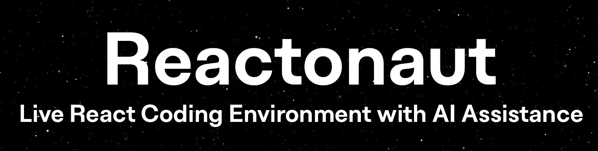

# Reactonaut     

Reactonaut was created to reduce the "coding language barrier" and allow new front-end developers to easily experiment with new UI designs with the aid of an AI assistant.

Reactonaut also helps developers allocate more time to bigger ideas, such as UI layouts, overall theme, and functionality, rather than spending time struggling over design tasks.

## Demo
### ChatGPT Integration - easily apply and view AI implemented code

### Code Editing Experience - undo action & set file name

## Features
- Live code editing with Ace Editor
- React-Live for real-time rendering of React components
- OpenAI's ChatGPT API integration for code suggestions
- Interactive chat interface for seamless communication with ChatGPT

## Target Users
| Current | Future |
| -------- | ------- |
| JS/React Developers | All Develepers|
| Mostly for New Devs | Both New & Experienced |
| Mostly for Front-End | Both Front & Back-End |

## Future Plans

- Improve AI assistant speed
- Implement prompt enhancing feature
- Implement file access feature (work on files stored locally or on cloud)
- Implement a more advanced editor
- Allow more languages (back-end)
- Implement Open AI's CodeX for code analysis & optimization

## Credits
The initial backend structure has been produced by [admineral](https://github.com/admineral).

After our collaboration in an [AI Startup Hackathon](https://lablab.ai/event/ai-startup-hackathon-episode-3/reactonauts/reactonaut-ai-code-editor), Reactonaut was separated from his original project [Reactor](https://github.com/admineral/Reactor) with a new UI and is being developed as a stand-alone project.
